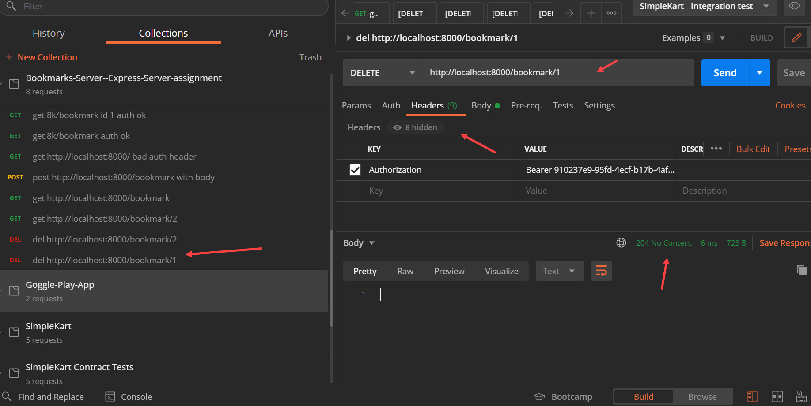

## >> App Name:

Bookmarks-Server--Express-Server-assignment

## >> APP Summary:

This project builds an Express Server with a secured API endpoint so that it can be safely opened to the public. It uses Express Router API so the endpoint with ID key(:id) is supported to target a particular piece of information of the 'database' (an in-memory array-based object).

this project get the starter code via Project [express-boilerplate](https://github.com/davetam88/express-boilerplate)

Error handling/reporting will be via an info.log file facilitate with the Winston logging library middleware and the response code/message.

Note that endpoint only responds when given a valid Authorization header with a Bearer API token value. You can use the following page link to generate one  :
[UUID generator](https://www.uuidgenerator.net/version1)

Once it's generated, place the UUID string inside a .env file along with the NODE_ENV and server port number, similar to the following example.
```
NODE_ENV=development 
PORT=8000
API_TOKEN=YOUR-UUID
```

The endpoint supported are : 
```
GET /bookmark
GET /bookmark/:id
POST /bookmark
DELETE /bookmark/:id
```

The GET /bookmark endpoint return arrays of bookmarks
The GET /bookmark/:id endpoint return bookmark item referenced by the route ID(:id).
The POST /bookmark endpoint allows the user to add a bookmark 
the database. 
and DELETE /list/:id allow ueer to delete a bookmark object.

A sample format for the bookmark data/body information is as follows:
```
bookmark data format 
{
    "title" : "title 6", 
    "url" : "url 6", 
    "description" : "description 6", 
    "rating" : "rating 6", 
}
```

## >> Screenshots

Deletet query with Authorization header



## >> Technologies used in this APP:

* Express Server
* app.get API
* Express middleware
* API tokens
* Authorization headers
* doenv (for the .env API authehitic key file)
* CORS
* Helmet
* Winston logging library
* morgan loggging tool

-> Javascript: ES6

-> Tools
* Postman
`* VSC Debugger
* nodemon 
* NPM


## >> [Github Link](https://github.com/davetam88/Bookmarks-Server--Express-Server-assignment )
